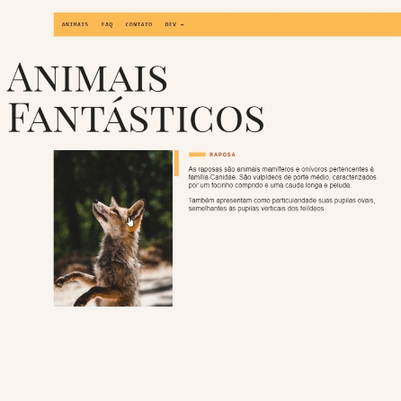

# Animação em JavaScript

Este repositório contém um conjunto de funções em JavaScript para aprimorar a interatividade e o apelo visual do seu site por meio de animações. As funções fornecidas abrangem vários aspectos, incluindo navegação por abas, comportamento de acordeão, rolagem suave e animações acionadas por rolagem.

## Logo

  

## Sumário

- [Tecnologias Utilizadas](#tecnologias-utilizadas)
- [Status](#status)
- [Descrição](#descrição)
- [Funcionalidades](#funcionalidades)
- [Autor](#autor)

## Tecnologias Utilizadas

  

    
  

  

    
  

## Status

<!--  -->

## Descrição

Esse código é um conjunto de funções JavaScript que implementam diferentes funcionalidades para uma página web.

## Funcionalidades

`initTabNav():` Essa função lida com uma navegação de abas. Ela seleciona os elementos do menu de abas e os conteúdos correspondentes. Quando uma aba é clicada, ela ativa a aba correspondente, mostrando o conteúdo associado e ocultando os outros.

`initAccordion():` Esta função trata de um componente de acordeão. Ela seleciona os itens do acordeão e adiciona um comportamento de expansão/recolhimento quando um item é clicado. Apenas um item pode estar expandido por vez.

`initScrollSuave():` Aqui, há uma função para rolar suavemente até as seções da página quando determinados links internos são clicados. Isso melhora a experiência de navegação, evitando saltos abruptos.

`initAnimacaoScroll():` Essa função lida com a animação de elementos ao rolar a página. Cada seção marcada com a classe "js-scroll" se torna ativa quando é visível na janela, adicionando a classe "ativo" e removendo quando está fora da visão.

## Autor

Desenvolvido por Origamid® tendo como colaborador Diego Franco.
